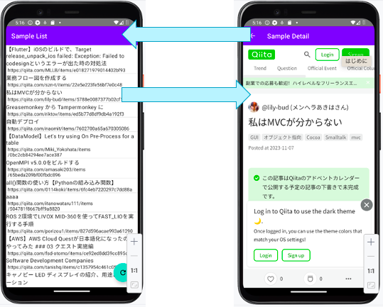

# Compose Multiplatformで作ったQiitaリーダーのサンプル

## 概要
Qiitaの記事を取得して一覧表示するためのアプリのサンプルです。画面構成は以下の通りです。
 
- 一覧画面
  - FABをクリックするとQiitaのAPIをリクエストし、最新20件を取得、その内容を画面にリスト表示する
  - リストの各アイテムをタップすると、詳細画面に遷移する。
  - 右上の×ボタンをタップすると一覧をクリアする。

- 詳細画面
  - 各記事のURLの内容をWebViewで表示する。
  - 一覧画面に戻るナビゲーションを持つ。

## 画面イメージ

## ソースコードの構成
下記の通り。

* `/composeApp` is for code that will be shared across your Compose Multiplatform applications.
  It contains several subfolders:
  - `commonMain` is for code that’s common for all targets.
  - Other folders are for Kotlin code that will be compiled for only the platform indicated in the folder name.
    For example, if you want to use Apple’s CoreCrypto for the iOS part of your Kotlin app,
    `iosMain` would be the right folder for such calls.

* `/iosApp` contains iOS applications. Even if you’re sharing your UI with Compose Multiplatform,
  you need this entry point for your iOS app. This is also where you should add SwiftUI code for your project.

Learn more about [Kotlin Multiplatform](https://www.jetbrains.com/help/kotlin-multiplatform-dev/get-started.html)

## 動作環境
- Android14の実機/エミュレータ
- iOS 16のシミュレータ

## 開発環境
- Android Studio Hedgehog RC2
  - Kotlin Multiplatformプラグイン 0.8.0
- Kotlin 1.9.20
- Compose 1.5.x
- Xcode 14.3.1

## 注意点
- ひとまずCompose Multiplatformでアプリを作るには、ということを示すためのサンプルです。
- エラー処理は特にしていません。(今後記事の中で触れます。)
- テストは書いていないです。(今後記事の中で触れるかもしれません。)

## その他
- [NTTテクノクロス Advent Calendar 2023](https://qiita.com/advent-calendar/2023/ntt-tx)

